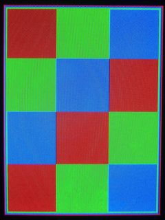
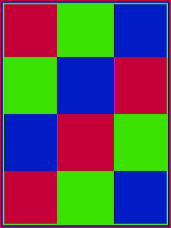
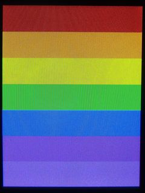
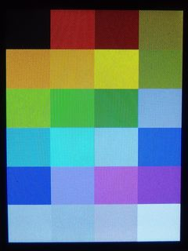
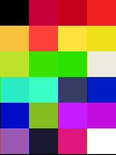
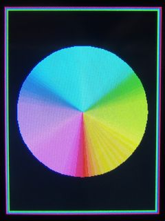
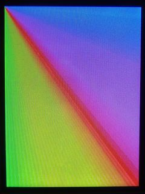
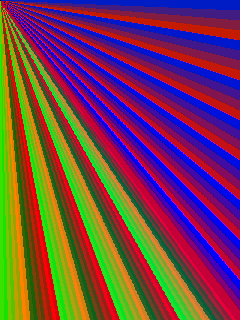
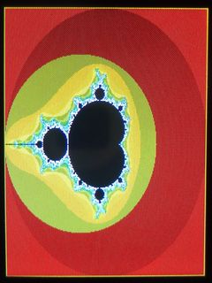
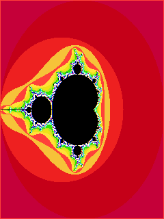

# First steps with the ESP32-2432S028R
I was interested in the ***Cheap Yellow Display*** or ***CYD*** as [Brian Lough](https://www.youtube.com/watch?v=0AVyvwv0agk) called it, because it combines an ESP32 with display, touchscreen, SD card reader, audio output, RGB LED and phototransistor on one board - and all for very little money.

After some research on the Internet, however, I soon realized that the board obviously has its peculiarities, not to say design flaws. All the more exciting to experiment with it!

I found the board definition *esp32-2432S028R.json* for PlatformIO [here](https://github.com/rzeldent/platformio-espressif32-sunton/) and put it into my bords folder .platformio\platforms\espressif32\boards

A little later I realized that the graphical library [***LovyanGFX***](https://github.com/lovyan03/LovyanGFX) is the better choice for a display with touch function than the usually used library [*TFT_eSPI*](https://github.com/bodmer) from Bodmer.

The first thing I wanted to do was to build a small menu system with which I could display various graphic patterns on the screen and then save the images on the SD card as a RGB565 bitmap.

However, this project failed because I was unable to operate the display, touchscreen and SD card at the same time. Either the display and the touchscreen or the display and the SD card worked, but never all three together.

Operating the SD card or touchscreen on the SPI_HOST HSPI or VSPI or vice versa was also unsuccessful. Either I could operate the touchscreen but not save any bitmaps, or I could save bitmaps but the touchscreen did not respond.

Nevertheless, I made some graphics and saved them to the SD card as RGB565 bitmaps and converted them to png with XnView, so that i can show them in this README. To my great disappointment, the colors in the saved bitmaps did not match those on the screen, as these pictures show:

| Screen | Bitmap |
|:------:|:------:|
|    |  |
|    |  |
|    |  |
|    |  |
|    |  |
|  |  |

*Does anyone have an explanation for this unexpected effect?*

As a little bonus, I let the RGB LEDs flash alternately at second intervals, 🔴red, 🟢green, 🔵blue, ... This flashing runs in the second core of the ESP32, independently of the graphics routines running in the main loop.